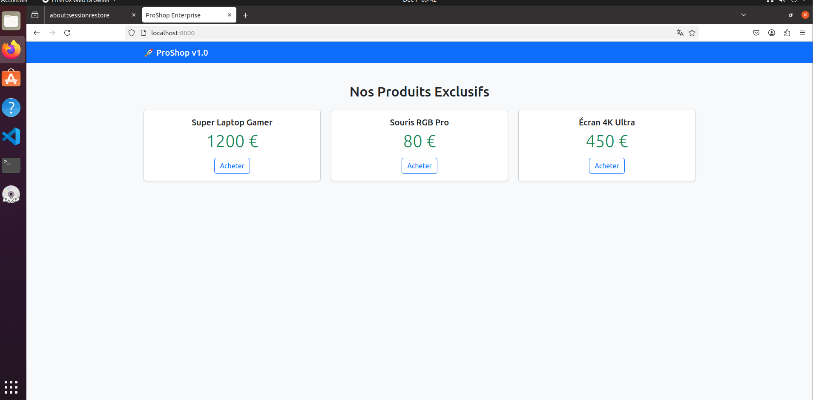
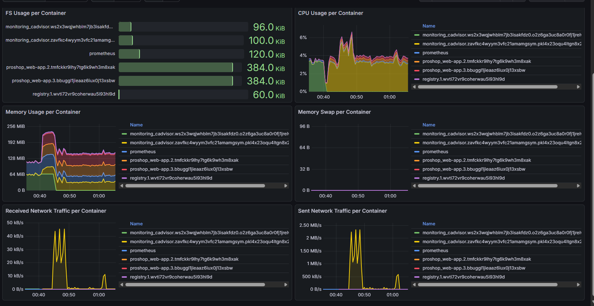

# ProShop Swarm — E-commerce Haute Disponibilité

E-commerce Flask + PostgreSQL sur un cluster **Docker Swarm 3 nœuds** (haute disponibilité) :

## Fonctionnalités
- 3 replicas Flask (load-balancing automatique)
- PostgreSQL persistante (volume sur node1)
- Traefik + HTTPS auto
- Monitoring Grafana + Prometheus + cAdvisor
- Registry local + Portainer pour gestion web

## Démo

## Lancement rapide (sur Ubuntu VMs)
1. `docker swarm init --advertise-addr 192.168.137.60`
2. `docker stack deploy -c docker-compose.yml proshop`

Site disponible sur http://192.168.137.60:8000 (ou https://proshop.local avec Traefik).

## Tech Stack
- Backend : Flask + psycopg2
- DB : PostgreSQL 13
- Infra : Docker Swarm, Traefik, Grafana

#Docker #Swarm #Flask #DevOps #Python #Monitoring
